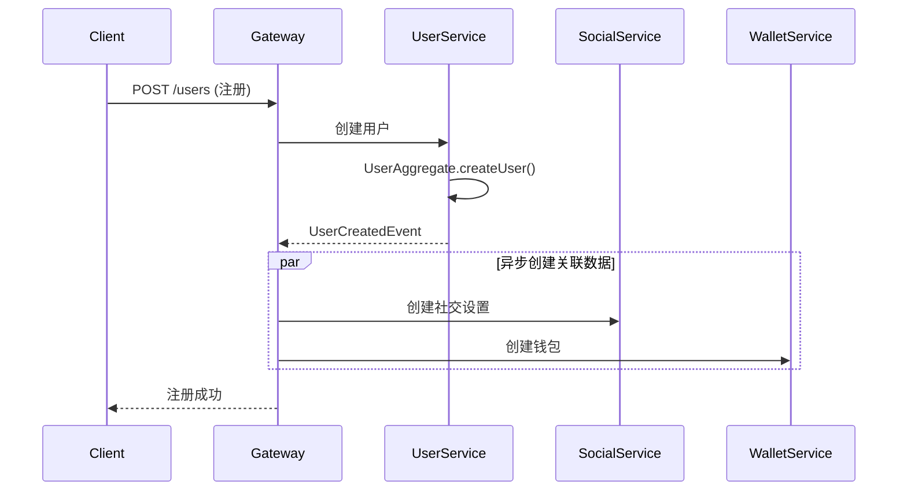
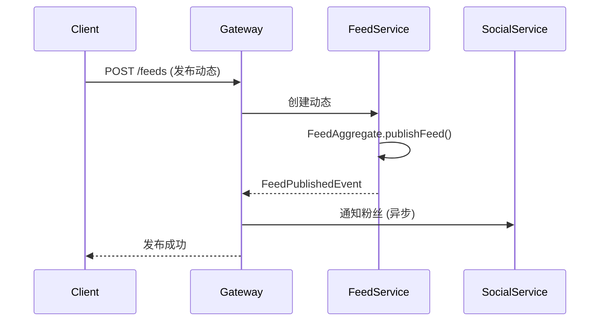

# 🏗️ XyPai-Users DDD微服务架构总览

## 🎯 **架构设计理念**

基于 **Domain-Driven Design (DDD)** 的微服务架构，每个服务围绕一个核心聚合根设计，实现高内聚、低耦合的分布式系统。

## 📊 **聚合根分布图**

```
🏗️ xypai-users (父模块)
├── 👤 user-service (9106)     - UserAggregate
├── 🤝 social-service (9107)   - SocialAggregate  
├── 💰 wallet-service (9108)   - WalletAggregate
├── 📱 feed-service (9109)     - FeedAggregate + InteractionAggregate
├── 🚪 gateway-service (8080)  - 统一网关
└── 📦 common                  - 公共组件
```

## 🎯 **核心聚合根设计**

### 👤 **UserAggregate - 用户聚合根**

**📍 位置**: `user-service` (端口9106)  
**🎯 职责**: 用户身份和基础信息管理

```
UserAggregate
├── User (实体)
├── UserProfile (实体)  
├── UserId (值对象)
└── 业务规则:
    ├── 用户注册/激活/禁用
    ├── 基础信息维护
    ├── 客户端类型管理 (web/app/mini)
    └── 隐私设置管理
```

**🔔 领域事件**:

- `UserCreatedEvent` - 用户创建
- `UserUpdatedEvent` - 用户信息更新
- `UserStatusChangedEvent` - 用户状态变更

---

### 🤝 **SocialAggregate - 社交聚合根**

**📍 位置**: `social-service` (端口9107)  
**🎯 职责**: 社交关系和互动管理

```
SocialAggregate
├── SocialRelation (实体)
├── SocialSettings (实体)
├── SocialStats (值对象)
├── SocialId (值对象)
└── 业务规则:
    ├── 关注/取消关注
    ├── 好友请求/接受/拒绝
    ├── 用户屏蔽/解除屏蔽
    ├── 隐私级别控制
    └── 社交统计计算
```

**🔔 领域事件**:

- `UserFollowedEvent` - 用户关注
- `UserUnfollowedEvent` - 取消关注
- `FriendRequestSentEvent` - 好友请求
- `FriendRequestAcceptedEvent` - 好友请求接受

---

### 💰 **WalletAggregate - 钱包聚合根**

**📍 位置**: `wallet-service` (端口9108)  
**🎯 职责**: 财务资产和交易管理

```
WalletAggregate
├── Wallet (实体)
├── WalletTransaction (实体)
├── WalletSettings (值对象)
├── Money (值对象)
├── WalletId (值对象)
└── 业务规则:
    ├── 余额管理 (可用/冻结)
    ├── 充值/提现/转账
    ├── 交易记录管理
    ├── 支付密码验证
    ├── 限额控制 (日/月)
    └── 乐观锁防并发
```

**🔔 领域事件**:

- `WalletCreatedEvent` - 钱包创建
- `WalletRechargedEvent` - 钱包充值
- `WalletWithdrawEvent` - 钱包提现
- `WalletTransferredEvent` - 钱包转账

---

### 📱 **FeedAggregate - 动态聚合根**

**📍 位置**: `feed-service` (端口9109)  
**🎯 职责**: 内容发布和时间线管理

```
FeedAggregate
├── UserFeed (实体)
├── FeedSettings (实体)
├── FeedTag (值对象)
├── FeedId (值对象)
└── 业务规则:
    ├── 动态发布/编辑/删除
    ├── 内容审核状态
    ├── 隐私级别控制
    ├── 媒体资源管理
    ├── 标签系统
    └── 浏览统计
```

**🔔 领域事件**:

- `FeedPublishedEvent` - 动态发布
- `FeedUpdatedEvent` - 动态更新
- `FeedDeletedEvent` - 动态删除

---

### 💬 **InteractionAggregate - 互动聚合根**

**📍 位置**: `feed-service` (端口9109)  
**🎯 职责**: 用户互动行为管理

```
InteractionAggregate
├── InteractionTarget (实体)
├── InteractionRecord (实体)  
├── TargetId (值对象)
├── InteractionId (值对象)
└── 业务规则:
    ├── 点赞/取消点赞
    ├── 收藏/取消收藏
    ├── 评论/回复评论
    ├── 分享统计
    ├── 互动统计聚合
    └── 防重复互动
```

**🔔 领域事件**:

- `TargetLikedEvent` - 内容点赞
- `TargetCommentedEvent` - 内容评论
- `TargetSharedEvent` - 内容分享

---

## 🔗 **跨聚合根协作模式**

### 📡 **同步协作**

```java
// 示例：用户创建时同步创建钱包和社交设置
UserCreatedEvent → 
├── SocialService.createSocialSettings()
└── WalletService.createWallet()
```

### 🔔 **异步协作**

```java
// 示例：动态发布时异步更新社交统计
FeedPublishedEvent → 
├── SocialService.updateUserActiveStats() (异步)
└── InteractionService.initInteractionTarget() (异步)
```

### 🎯 **最终一致性策略**

- **强一致性**: 聚合根内部操作
- **最终一致性**: 跨聚合根数据同步
- **补偿机制**: 分布式事务失败回滚

---

## 🏗️ **DDD分层架构**

每个微服务都遵循相同的DDD分层结构：

```
📁 {service-name}/src/main/java/com/xypai/{domain}/
├── 🎯 domain/                    # 领域层
│   ├── aggregate/               # 聚合根
│   ├── entity/                  # 实体
│   ├── valueobject/            # 值对象
│   ├── enums/                  # 枚举
│   ├── service/                # 领域服务
│   ├── repository/             # 仓储接口
│   └── event/                  # 领域事件
├── 📋 application/              # 应用层
│   ├── service/                # 应用服务
│   ├── command/                # 命令对象
│   └── dto/                    # 数据传输对象
├── 🏗️ infrastructure/          # 基础设施层
│   ├── repository/             # 仓储实现
│   ├── mapper/                 # 数据映射
│   ├── event/                  # 事件发布
│   └── config/                 # 配置
└── 🌐 interfaces/              # 接口层
    ├── web/                    # REST控制器
    └── dto/                    # 响应对象
```

---

## 🎯 **业务流程示例**

### 🔸 **用户注册流程**



### 🔸 **动态发布流程**



---

## 🎉 **DDD架构优势**

### ✅ **业务聚焦**

- 每个聚合根专注特定业务域
- 业务规则封装在领域对象内
- 减少跨服务的复杂调用

### ✅ **技术优势**

- 独立部署和扩展
- 故障隔离和恢复
- 技术栈独立选择

### ✅ **团队协作**

- 清晰的服务边界
- 并行开发不冲突
- 专业化团队分工

### ✅ **演进能力**

- 聚合根可独立演进
- 新业务易于扩展
- 遗留系统平滑迁移

---

## 🚀 **下一步行动**

1. **🔸 完善领域模型** - 补充每个聚合根的完整业务逻辑
2. **🔸 实现应用服务** - 编排跨聚合根的业务流程
3. **🔸 建立事件机制** - 实现可靠的异步通信
4. **🔸 接口层开发** - 提供完整的REST API
5. **🔸 集成测试** - 验证整体业务流程

**🎯 准备好深入实现每个聚合根的完整DDD架构了吗？**
